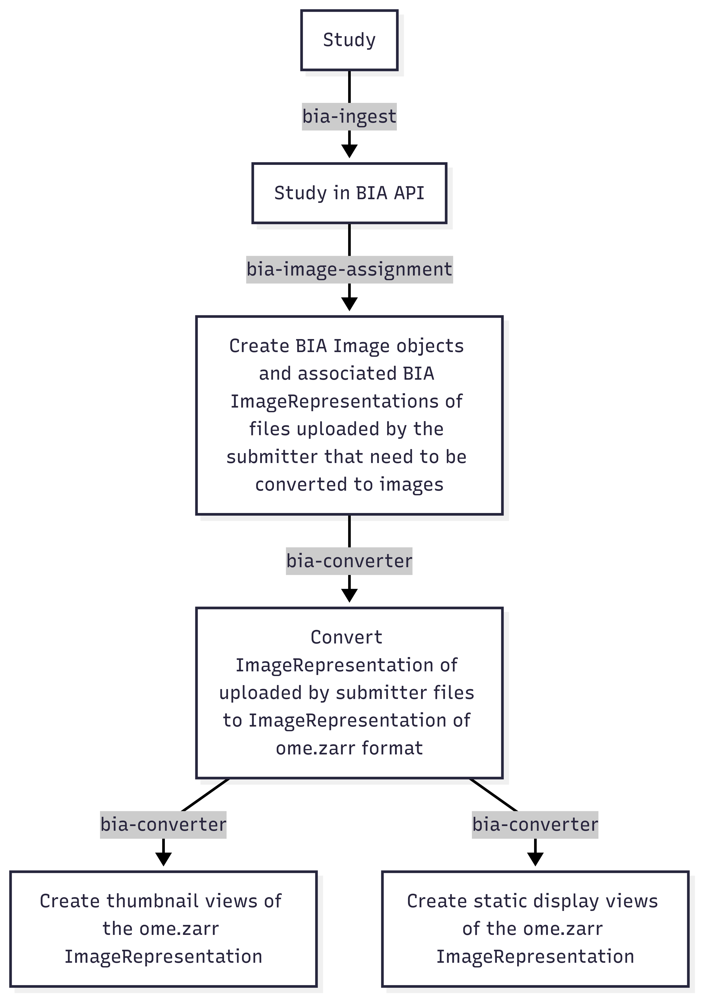

bia-converter
=============

## Description
This submodule deals specifically with converting images from one image format to another and/or modifying the *chunking* scheme of the underlying image data. Associated BIA ImageRepresentations are created and/or updated as necessary. Converted images are staged on EBI's S3 storage.

The diagram below gives an overview of the typical steps involved in end-to-end image conversion.



## 📦 Installation
This module (and others in the bia-integrator package) use [poetry](https://python-poetry.org/) which can be installed using instructions from the [official website](https://python-poetry.org/docs/#installation).

To install the `bia-converter` module cd to the directory containing this readme and run:

```bash
poetry install
```
See [Post installation configuration section](#post-installation-configuration) for setting configuration details

## Usage
The cli commands in this module take image representations as inputs. If the image representation is that of the image that was originally uploaded by the user, the *assignment* of a `BIA Image` object **must** have been carried out - see the [bia-assign-image subpackage](../bia-assign-image/README.md)

### `convert`

Run a specified image conversion function on a given image representation.

```bash
bia-converter convert <IMAGE_REP_UUID> [CONVERSION_FUNCTION_NAME] [CONVERSION_CONFIG]
```

- `IMAGE_REP_UUID`: UUID of the image representation.
- `CONVERSION_FUNCTION_NAME` (optional): Name of the function in `bia_converter.convert` to run. Defaults to `convert_uploaded_by_submitter_to_interactive_display`.
- `CONVERSION_CONFIG` (optional): JSON string with config options (not currently used).

**Examples**:

```bash
bia-converter convert 123e4567-e89b-12d3-a456-426614174000
```

```bash
bia-converter convert 123e4567-e89b-12d3-a456-426614174000 convert_interactive_display_to_static_display
```

---

### `create-thumbnail`

Create a thumbnail from an `INTERACTIVE_DISPLAY` image representation.

```bash
bia-converter create-thumbnail <IMAGE_REP_UUID>
```

**Example**:

```bash
bia-converter create-thumbnail 123e4567-e89b-12d3-a456-426614174000
```

This will log the URI of the generated thumbnail after processing.

  ---

### `create-static-display`

Create a static display from an `INTERACTIVE_DISPLAY` image representation.

```bash
bia-converter create-static-display <IMAGE_REP_UUID>
```

**Example**:

```bash
bia-converter create-static-display 123e4567-e89b-12d3-a456-426614174000
```

This will log the URI of the generated static display image after processing.
## TODO

* Update the scripts in [./scripts](./scripts) to work with new `bia-converter` and `bia-assign-image` commands
* Allow overrides when units are not set correctly
* More broadly, support passing in conversion options
* Support routes where we can convert *some* subtypes of a representation (e.g., ``UPLOADED_BY_SUBMITTER`` MRC files to PNG)
* Add zarr2zarr functionality back
* Modernize/share the OME-Zarr reading code


## Post-installation configuration
The `.env_template` in this directory contains the items that can be configured for `bia-converter`. The `.env_template` file can be copied into a `.env` file in this folder and the settings adjusted as required. Alternatively, the values for each setting can be set using environment variables of the setting name. These override any values in the `.env` file.

  **For retrieving objects from the API**, set:

     - ``api_base_url``
     - ``bia_api_username``
     - ``bia_api_password``

  - **For caching downloaded/converted images locally**, the default location is ``~/.cache/bia-converter/``. Change this by setting:

     - ``cache_root_dirpath``

   - **For conversion to Zarr format**, The official docker image of [bioformats2raw](https://hub.docker.com/r/openmicroscopy/bioformats2raw/tags) via singularity is preferred (you only need to have singularity and/or docker installed on your machine). If singularity or docker is not available, the bioformats2raw cli can be installed via a package manager or built from the [github repo](https://github.com/glencoesoftware/bioformats2raw/tree/master) and the following set in the ``.env`` file:

     - ``bioformats2raw_java_home``
     - ``bioformats2raw_bin``
     - ``bioformats2raw_docker_tag``

   - **For uploading to S3**, set:

     - ``endpoint_url``
     - ``bucket_name``

   - The AWS credentials for the endpoint also need to be set. This can be done exclusively via environment variables. Either:

     - ``AWS_ACCESS_KEY_ID`` *and* ``AWS_SECRET_ACCESS_KEY``
     - OR use ``AWS_SHARED_CREDENTIALS_FILE`` with optional ``AWS_PROFILE`` and/or ``AWS_CONFIG_FILE``


## Scripts
The [scripts](./scripts) sub-directory contains a bash script for a sample workflow to produce converted images for a BIA study.
