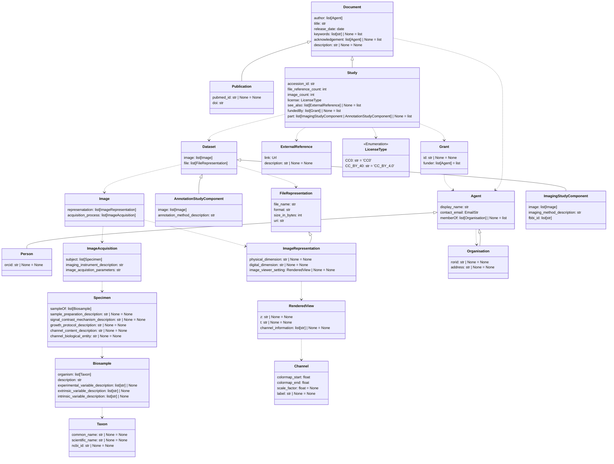

<!--- Note that file is manually modified after generation to make reading it easier. Please don't overwrite directly. --->

```mermaid
classDiagram

    class Dataset {
        image: list[Image]
        file: list[FileRepresentation]
    }

    class ExternalReference {
        link: Url
        description: str | None = None
    }

    class Person {
        orcid: str | None = None
    }

    class Image {
        represenatation: list[ImageRepresentation]
        acquisition_process: list[ImageAcquisition]
    }

    class ImageAcquisition {
        subject: list[Specimen]
        imaging_instrument_description: str
        image_acquistion_parameters: str
    }

    class LicenseType {
        <<Enumeration>>
        CC0: str = 'CC0'
        CC_BY_40: str = 'CC_BY_4.0'
    }

    class AnnotationStudyComponent {
        image: list[Image]
        annotation_method_description: str
    }

    class Publication {
        pubmed_id: str | None = None
        doi: str
    }

    class Study {
        accession_id: str
        file_reference_count: int
        image_count: int
        license: LicenseType
        see_also: list[ExternalReference] | None = list
        fundedBy: list[Grant] | None = list
        part: list[ImagingStudyComponent | AnnotationStudyComponent] | None = list
    }

    class Biosample {
        organism: list[Taxon]
        description: str
        experimental_variable_description: list[str] | None
        extrinsic_variable_description: list[str] | None
        intrinsic_variable_description: list[str] | None
    }

    class FileRepresentation {
        file_name: str
        format: str
        size_in_bytes: int
        uri: str
    }

    class Grant {
        id: str | None = None
        funder: list[Agent] = list
    }

    class ImageRepresentation {
        physical_dimension: str | None = None
        digital_dimension: str | None = None
        image_viewer_setting: RenderedView | None = None
    }

    class Document {
        author: list[Agent]
        title: str
        release_date: date
        keywords: list[str] | None = list
        acknowledgement: list[Agent] | None = list
        description: str | None = None
    }

    class Agent {
        display_name: str
        contact_email: EmailStr
        memberOf: list[Organisation] | None = list
    }

    class Taxon {
        common_name: str | None = None
        scientific_name: str | None = None
        ncbi_id: str | None = None
    }

    class Channel {
        colormap_start: float
        colormap_end: float
        scale_factor: float = None
        label: str | None = None
    }

    class ImagingStudyComponent {
        image: list[Image]
        imaging_method_description: str
        fbbi_id: list[str]
    }

    class Specimen {
        sampleOf: list[Biosample]
        sample_preparation_description: str | None = None
        signal_contrast_mechanism_description: str | None = None
        growth_protocol_description: str | None = None
        channel_content_description: str | None = None
        channel_biological_entity: str | None = None
    }

    class Organisation {
        rorid: str | None = None
        address: str | None = None
    }

    class RenderedView {
        z: str | None = None
        t: str | None = None
        channel_information: list[str] | None = None
    }

    Agent ..> Organisation
    Grant ..> Agent
    Document ..> Agent
    Study ..> Dataset
    Study ..> ExternalReference
    Study ..> LicenseType
    Study ..> Grant
    Dataset ..> Image
    Dataset ..> FileRepresentation
    Image ..> ImageAcquisition
    Image ..> ImageRepresentation
    ImageAcquisition ..> Specimen
    Specimen ..> Biosample
    Biosample ..> Taxon
    ImageRepresentation ..> RenderedView
    RenderedView ..> Channel


    Agent <|-- Person
    Agent <|-- Organisation
    Document <|-- Publication
    Document <|-- Study
    Dataset <|-- AnnotationStudyComponent
    Dataset <|-- ImagingStudyComponent
    FileRepresentation <|-- ImageRepresentation


```