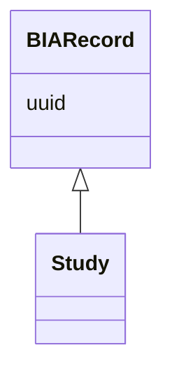

# Class: BIARecord


_a individal record stored in the BioImageArchive_


URI: [bia-shared-datamodels:BIARecord](https://www.ebi.ac.uk/bioimage-archive/schema/BIARecord)





<!-- no inheritance hierarchy -->


## Slots

| Name | Cardinality and Range | Description | Inheritance |
| ---  | --- | --- | --- |
| [uuid](uuid.md) | 1 <br/> [String](String.md) | uuid for the record - this can be used to programmatically retreive the recor... | direct |


## Mixin Usage

| mixed into | description |
| --- | --- |
| [Study](Study.md) | A study in the BioImageArchive represents a set of image data, and the scienf... |


## Identifier and Mapping Information


### Schema Source


* from schema: https://www.ebi.ac.uk/bioimage-archive/schema/


## Mappings

| Mapping Type | Mapped Value |
| ---  | ---  |
| self | bia-shared-datamodels:BIARecord |
| native | bia-shared-datamodels:BIARecord |


## LinkML Source

<!-- TODO: investigate https://stackoverflow.com/questions/37606292/how-to-create-tabbed-code-blocks-in-mkdocs-or-sphinx -->

### Direct

<details>
```yaml
name: BIARecord
description: a individal record stored in the BioImageArchive
from_schema: https://www.ebi.ac.uk/bioimage-archive/schema/
mixin: true
slots:
- uuid

```
</details>

### Induced

<details>
```yaml
name: BIARecord
description: a individal record stored in the BioImageArchive
from_schema: https://www.ebi.ac.uk/bioimage-archive/schema/
mixin: true
attributes:
  uuid:
    name: uuid
    description: uuid for the record - this can be used to programmatically retreive
      the record from the BIA API
    examples:
    - value: 00000000-0000-0000-0006-09b5d587b158
    from_schema: https://www.ebi.ac.uk/bioimage-archive/schema/
    rank: 1000
    identifier: true
    alias: uuid
    owner: BIARecord
    domain_of:
    - BIARecord
    range: string

```
</details>