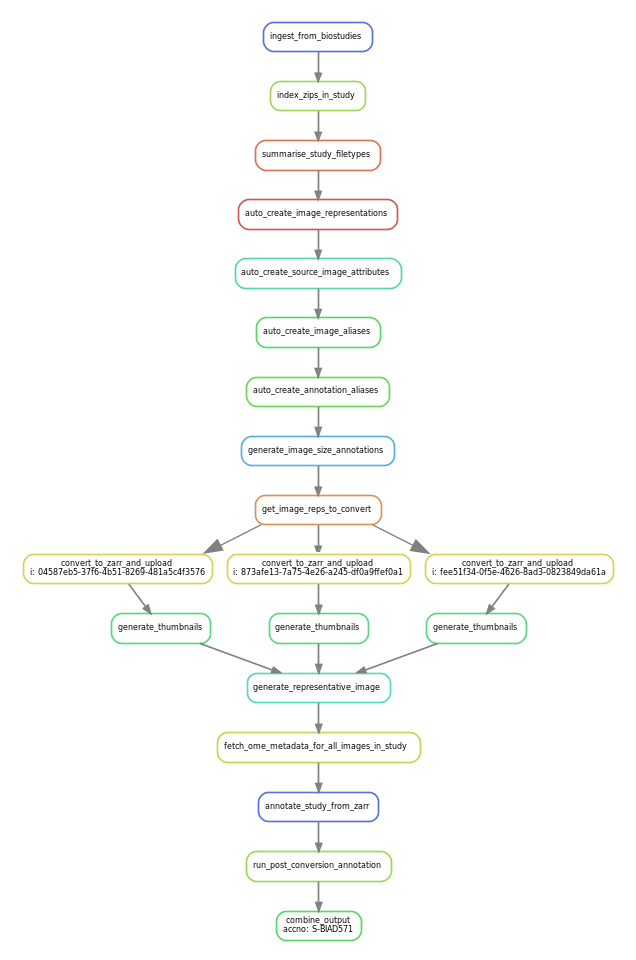

BIA integrator snakemake workflow
=================================

Snakefile to implement BIA integrator snakemake workflow. 

    To run this script the following are needed:
    1. export accession id of submission e.g. 
        export ACCNO="S-BIAD679"
    2. env variables for convert_to_zarr e.g.
        export bioformats2raw_java_home=/miniconda3/envs/bia/
        export bioformats2raw_bin=/miniconda3/envs/bia/bin/bioformats2raw
    3. AWS S3 credentials for upload to Embassy s3 e.g.
        export AWS_PROFILE=embassy 
        export AWS_SHARED_CREDENTIALS_FILE=/.aws/embassy_s3_credentials
        export AWS_CONFIG_FILE=/.aws/embassy_s3_config
       OR
        export AWS_ACCESS_KEY_ID=XXXXXXXXXXXXXXXXXXXXX
        export AWS_SECRET_ACCESS_KEY=abcdefgh1234567890

    The following are required if using Singularity container e.g.
        export SINGULARITY_CONTAINER_PATH="/singularity/bia_v1.2.1.sif"
        export CONTAINER_COMMAND_PREFIX="conda run -n bia"

    The following are optional depending on your setup:
    1. Overrides for default storage (esp. if running on EBI clusters) e.g.
        export data_dirpath=/hps/nobackup/.bia-integrator-data/
        export cache_root_dirpath=/hps/nobackup/.cache/bia-converter

    2. Override default location of bia-integrator scripts:
        export BIA_INTEGRATOR_TOOLS_SCRIPT_DIR="/bia-integrator/tools/scripts/"
    3. Override default (6) number of images to convert:
        export BIA_INTEGRATOR_N_IMAGES_TO_CONVERT=3

    To run workflow
    1. Activate virtual environment containing snakemake tools:
        source ${BIA_INTEGRATOR_TOOLS_SCRIPT_DIR}../venv/bin/activate
    2. Run command from of bia-integrator/tools/snakemake:
        snakemake --cores 6 work_dir/final_output_${ACCNO}.log

